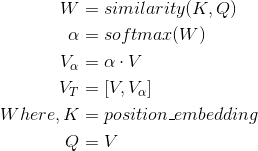

# QANet_dureader

本人曾随队在[mrc2018机器阅读理解比赛](http://mrc2018.cipsc.org.cn/)中获得`TOP11`的名次，当时使用的是[BIDAF](https://arxiv.org/abs/1611.01603)，现尝试使用[QANet](https://arxiv.org/abs/1804.09541)去尝试dureader数据集

## 说说QANet
- **全卷积操作**： 包括encoder layer, fully-connected layer都是采用全卷积结构
- **残差块**: 使用了残差网络来加深网络深度
- **自注意**: Google采用了自家的[multihead attention](https://arxiv.org/abs/1706.03762) 来计算`self attention`
- **强化位置信息**： 正因为卷积网络捕获不到位置信息，所以QANet强化了这点，在每个卷积块中都加入了时间序列信息，可查看`layers / residual_block / add_timing_signal_ld`

### 小小改进
加入原始位置信息(position embedding)在decoder层做Attention计算，至于效果嘛，大家对比测试便知:>

<div align=center>

## 模型

### requirements
```
tensorflow 1.6+
jieba
```

### 语料预处理
包括生成词典，使用预训练词向量，本模型支持[Chinese-Word-Vectors](https://github.com/Embedding/Chinese-Word-Vectors)中预训练词向量，下载该模型词向量后在`cli.py`中指定即可.

```bash
python3 cli.py --prepro
```

### 训练
```bash
python3 cli.py --train [arguments]
```

或者直接采用封装好的bash训练
```bash
bash train.sh
```
### 使用全量数据训练
请先下载全量数据，已封装bash
```bash
bash data/download_dureader.sh
```

## Reference
- [DuReader](https://github.com/baidu/DuReader)
- [QANet Baseline](https://github.com/NLPLearn/QANet)
